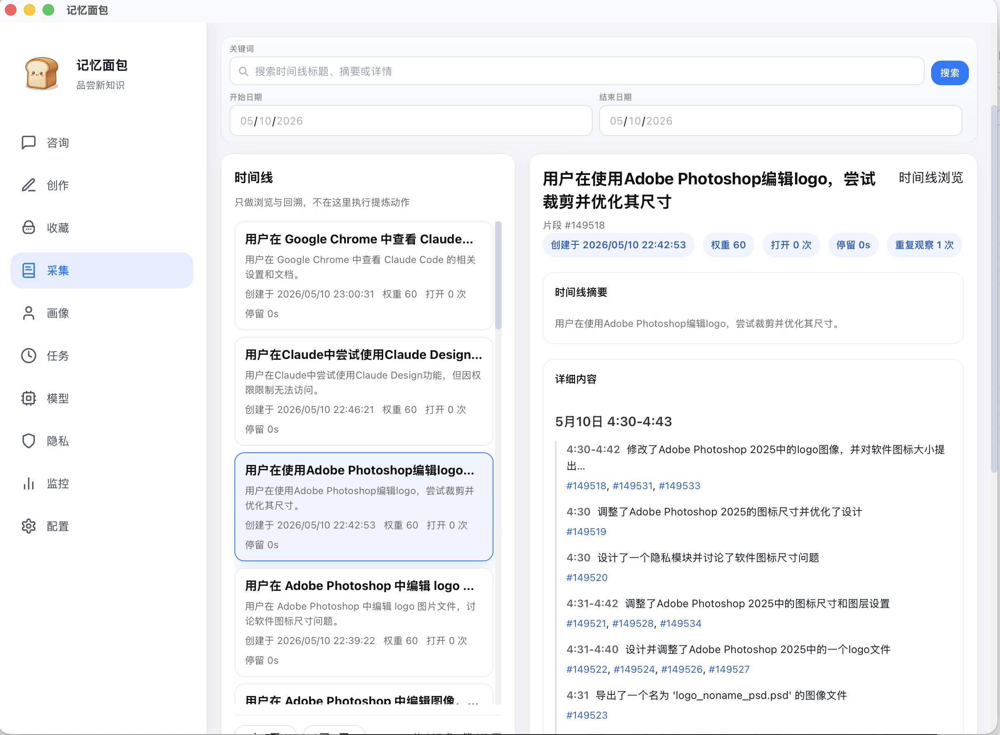

  

# 记忆面包

### 让 AI 真的记住你的工作

**本地 AI 桌面助手 · 上下文持续积累 · 工作文档一键生成 · 隐私更可控**

  <strong>🧠 越用越懂你</strong> ·
  <strong>🍞 工作自动沉淀</strong> ·
  <strong>📄 文档生成利器</strong> ·
  <strong>🔐 完全本地化</strong>

<code>完全本地化</code> <code>文档生成</code> <code>长期自动记忆</code> <code>隐私可控</code>

---

## 快速导航

- [一句话理解](#一句话理解)
- [真实界面](#真实界面)
- [为什么它容易被记住](#为什么它容易被记住)
- [核心价值](#核心价值)
- [文档生成：记忆面包最直接的价值](#文档生成记忆面包最直接的价值)
- [典型场景](#典型场景)
- [本地化、安全与隐私](#本地化安全与隐私)
- [FAQ](#faq)

---

## 一句话理解

> **记忆面包不是让你“再问 AI 一次”，而是让已经发生过的工作，继续为以后创造价值。**

它会把浏览、编辑、检索、创作这些日常工作过程，逐步沉淀成：

- 📌 可回忆的上下文
- 📚 可检索的知识
- 🧩 可复用的模板
- 🛠 可参考的处理经验

---

## 用户界面

从这个界面你能直接看出它的产品形态：

- 🧭 **不是单点聊天**：而是一整套桌面工作入口
- 🔥 **不是黑盒生成**：提炼、筛选、沉淀过程可见
- 🧩 **不是一次性回答**：知识、模板、SOP 可以持续复用
- 🪄 **不是玩具感 AI**：更像真正能长期使用的工作台

---

## ✨ 为什么它容易被记住

- 🧠 **越用越懂你**：不再每次重讲背景
- 🍞 **工作自动沉淀**：过程逐步变成资产
- ✍️ **创作可复用**：表达风格和结构可以延续
- 🪄 **更容易用起来**：有引导、有入口、不打断工作流
- 🌏 **更适合中文场景**：更贴近中文办公与创作习惯
- 🔐 **本地优先**：能力、数据与边界更可控

---

## 这款产品解决什么问题

日常工作里，最贵的不是信息太少，而是信息一直在流失：

- 你看过很多页面，但几天后想不起在哪看到过
- 你处理过很多问题，但下次又要重新搜、重新问、重新整理
- 你写过很多文档，但风格、结构、表达方式无法持续复用
- 通用 AI 很聪明，但不了解你的历史语境、工作习惯和中文内容环境

记忆面包想解决的，是：

## **让工作过程不再只是“经过”，而能沉淀为长期资产。**

它把零散的工作痕迹逐步加工为：

- 📌 可回忆的历史上下文
- 📚 可检索的知识条目
- 🧩 可复用的内容模板
- 🛠 可参考的问题处理路径与 SOP

从此，AI 的回答不再只是“像是知道”，而是更接近：

> **基于你的真实工作历史来回答。**

---

## 🚀 和记忆面包一起工作的方式

### 🍽 吃面包
当你需要提问、追溯、创作或获得启发时，直接使用已经积累下来的上下文、知识与模板。

### 🔥 烤面包
系统会把高价值内容继续加工成更适合后续消费的资产，例如常用文章、模板候选、SOP 候选和问答增强材料。

### 🏠 醒发箱
所有沉淀出的内容不再散落在聊天记录、浏览器历史和文档碎片里，而是成为可以长期复用的个人知识资产。

这意味着它不只是“回答问题”，而是在帮助用户逐步建立自己的：

- 工作语料
- 知识结构
- 表达方式
- 处理经验

---

## 💎 核心价值

### 1. 把工作过程变成资产
不是做完就消失，而是越做越能留下可复用内容。

### 2. 让 AI 越用越懂你
不是一次性上下文，而是持续积累后的长期理解。

### 3. 让问答、创作、复盘形成闭环
今天的工作，会变成明天继续可用的材料。

### 4. 真正适合中文办公环境
从理解、提炼到复用，都更贴近中文工作流。

---

## 🆚 为什么它比普通 AI 工具更有价值

| 普通 AI 对话工具 | 记忆面包 |
|---|---|
| 每次都要重新解释背景 | 会基于历史上下文持续积累理解 |
| 回答偏通用 | 回答更贴近你的真实工作记录与知识资产 |
| 对话结束后价值容易流失 | 对话、浏览、写作、处理过程都会沉淀 |
| 更像临时助手 | 更像长期陪跑的工作伙伴 |
| 很难复用你的表达风格 | 可以沉淀模板、风格样本与常用表达 |
| 通常默认云端依赖 | 支持更强的本地化与可控性 |

---

## 📄 文档生成：记忆面包最直接的价值

这是记忆面包最受欢迎的能力之一——**不是让你对着空白页发愁，而是基于你真实的工作积累，帮你高质量地生成各类工作文档。**

### 能生成哪些文档？

| 文档类型 | 说明 |
|---|---|
| 📊 **市场运营方案** | 结合你的产品背景与历史策略生成，不是泛泛而谈 |
| 🎨 **产品设计方案** | 参考你的 PRD 习惯、产品风格和已有设计决策 |
| 🔧 **技术方案** | 基于你的技术栈、架构偏好和历史决策来起草 |
| 🏗 **架构设计方案** | 结合你项目的实际约束和技术选型来设计 |
| 📝 **工作总结 / 项目总结** | 用你的真实工作记录自动提炼，而不是硬凑内容 |
| 📅 **工作周报 / 月报 / 季报 / 年报** | 按你的表达风格和格式自动生成，改一改就能用 |
| 📖 **工作指导手册 / SOP** | 将你处理过的重复性问题沉淀成可复用的操作手册 |

### 为什么记忆面包生成的文档比直接问 AI 更好用？

普通 AI 生成的文档往往「像模像样，但不像你」——因为它不了解你的项目背景、你的表达习惯、你团队的语境。

记忆面包的文档生成基于你真实积累下来的工作内容：

- ✅ 调用你之前写过的方案结构和用词习惯
- ✅ 引用你实际的工作记录、项目上下文
- ✅ 延续你的表达风格，而不是通用模板腔
- ✅ 把重复用到的文档格式沉淀为模板，下次更快

> **你不需要重新解释背景，它已经记得你的上下文。你只需要告诉它要写什么。**

---

## 🎯 典型场景

- 🔎 **历史回忆**：我上周看过的那个页面，具体写了什么？
- 📄 **文档生成**：帮我按我的风格起一份技术方案 / 产品 PRD / 工作周报
- ✍️ **内容创作**：按我以前的方案、周报、PRD 风格起一版新的结构
- 💬 **知识问答**：结合我最近的工作记录回答这个问题
- 🧭 **工作提示**：类似问题我以前通常怎么推进
- 🧱 **模板复用**：把反复出现的高价值文档沉淀成模板

---

## 🪄 为什么它更容易真正用起来

很多 AI 产品的问题，不是能力不够，而是难以融入真实工作流。

记忆面包在产品体验上更强调：

- 👋 **引导式上手**：首次使用可通过引导流程完成基础设置
- 🧩 **自然入口**：通过悬浮入口和桌面面板进入，而不是每次切出当前工作
- 🎛 **配置可理解**：模型、偏好与数据策略尽量以用户能理解的方式呈现
- 🧘 **持续陪伴感**：不是打断式使用，而是更像随时可调用的工作搭子

它追求的不是“炫技感”，而是：

> **真的能每天打开、真的能长期积累、真的能逐渐离不开。**

---

## 🔐 本地化、安全与隐私

这是记忆面包最重要的产品立场之一。

### 🏡 本地优先
- 以本地存储为基础
- 支持本地模型路线
- 云端能力按需启用，而不是默认依赖

### 🛡 隐私更可控
- 对敏感信息有脱敏与过滤思路
- 对特定隐私场景进行跳过或降低采集风险
- 允许用户管理自己的配置、数据保留策略与使用方式

### ✅ 安全边界更清晰
- 涉及敏感操作时强调确认
- 把“提示”“增强”“辅助”放在产品主路径上，而不是不加约束地替用户做决定

### 🌱 更适合长期使用
相比很多只追求模型效果的工具，记忆面包更关注在现实工作中是否好用、安心、可长期使用。

---

## 👥 适合谁

记忆面包特别适合这几类用户：

- 独立开发者
- 需要长期积累知识资产的个人工作者
- **经常需要写方案、总结、周报月报、PRD、运营方案、技术方案、架构设计等工作文档的人**（记忆面包能基于你的积累直接生成，不用每次从零开始）
- 希望拥有本地化 AI 助手，而不是把核心工作过程完全交给云端服务的人
- 希望让 AI 更理解自己，而不是每次都重新喂上下文的人

---

## FAQ

### 它和普通 AI 聊天工具最大的区别是什么？
不是只在你提问时回答一下，而是会把你已经发生过的工作过程逐步沉淀下来，让历史上下文、知识和模板在之后继续发挥作用。

### 它会替我自动执行敏感操作吗？
不会把高风险动作默认做成“无感自动执行”。记忆面包更强调提示、增强、辅助和确认边界，让用户保留最终控制权。

### 适合中文工作流吗？
适合。它从定位到内容理解、知识提炼、模板复用和表达支持，都更强调中文办公与中文创作场景。

### 这更像聊天助手，还是工作台？
更像一个长期工作的桌面工作台。聊天只是入口之一，真正重要的是持续积累、后续检索、再加工和反复复用。

---

## ❤️ 产品理念

记忆面包相信，真正有价值的 AI，不只是回答得更像人，而是能在长期使用中越来越理解你的工作世界。

不是更花哨。  
不是更喧闹。  
不是每次都重新开始。  

而是把你已经做过的事，慢慢变成以后持续受益的能力。

---

## 📍 当前方向

项目正在持续迭代中，重点围绕以下方向不断增强：

- 更自然的本地化 AI 助手体验
- 更高质量的知识提炼与内容沉淀
- 更强的模板复用与问答增强能力
- 更清晰的隐私、安全与可控边界

如果你关注的是 **本地 AI、个人知识沉淀、中文工作流增强**，以及一个真正能陪你长期使用的桌面助手，记忆面包就是为此而设计的产品。
